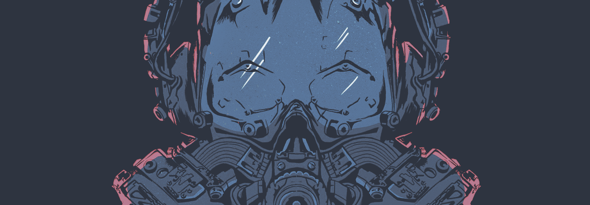

 

 

 
 
Used to do a lot of Blender. Currently doing a lot of python.
<h1>Artwork Porfolio</h1>
https://artstation.com/unayakani
<h1>Programming Portfolio</h1>
 
<ul>
  <li><a href="https://github.com/unayakani/3D22D">3D22D</a></li>
  <li><a href="https://github.com/unayakani/Monty-Hall-Simulator">Monty Hall Simulator</a></li>
  <li><a href="https://github.com/unayakani/Projectile-Trajectory-Plotter">Projectile Trajectory Plotter</a></li>
  <li><a href="https://github.com/unayakani/Hangman">Hangman</a></li>
</ul>
<h1>Other</h1>
<ul>
  <a href="https://github.com/unayakani/wallpapers">Wallpapers</a>
</ul>
